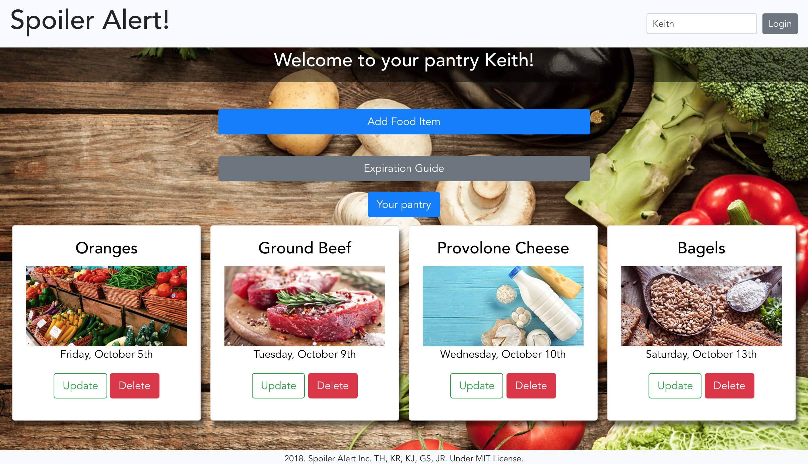

# Spoiler Alert!

---

So much food in the world goes to waste from consumers forgetting when it will expire. To help solve this problem, Spoiler Alert! allows users to log-in and curate their pantry list, tracking what food they have and when these foods will expire. Users can add new food items with the food's specific expiration dates, delete consumed or expired foods from their pantry list, or, if foods last longer than dated, users can update the expiration dates.

---

---

## Tech/Framework Used

---

<b>Built with</b>
- [Vue.js](https://vuejs.org/)
- [Bootstrap + Vue](https://bootstrap-vue.js.org/)
- [Express/Node.js](http://expressjs.com/)
- [Knex.js](https://knexjs.org/)
- [PostgresSQL](https://www.postgresql.org/)

---

